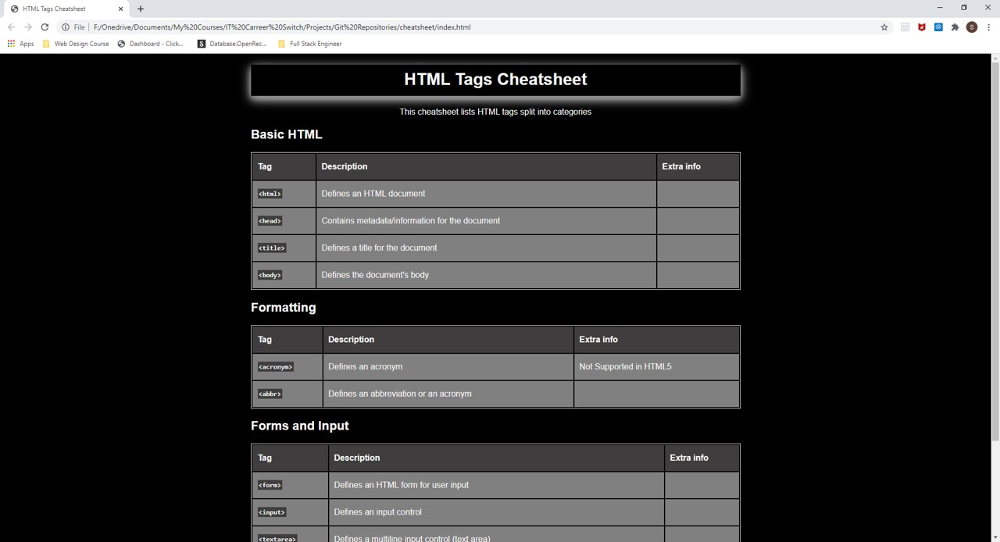

# Cheatsheat
## Table of contents
* Aim
* Technologies
* Screenshot
## Aim
The aim of this task was to produce a 'cheatsheet' in a formatted table using HTML and CSS.

## Technologies
I have utilised the following to complete the project:
- HTML
- CSS
- Git and GitHub for version control and storing the repository in the cloud

## Screenshot
The following is the result (to practice screenshot in Markdown):
